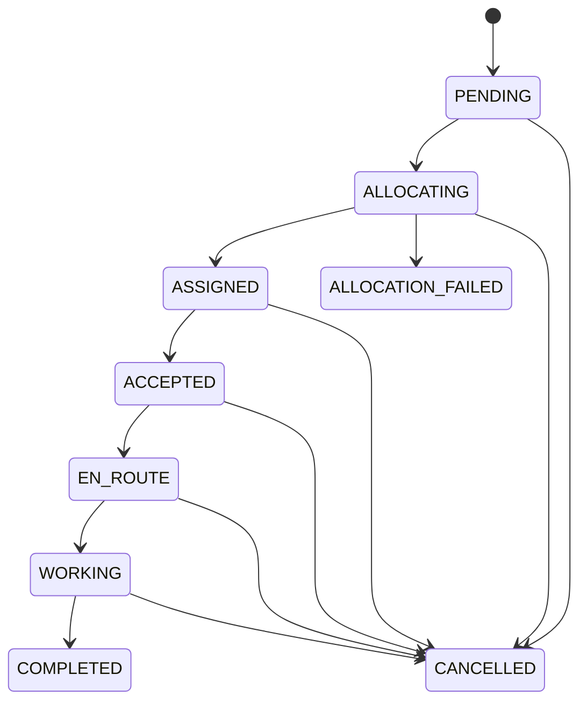

# Chore

Chore is a worker-based chore booking backend. It accepts customer bookings, identifies available workers associated with a service, and coordinates booking assignment. The project focuses on transactional booking creation, idempotency, worker eligibility, allocation coordination, and lifecycle state.

This pnpm/Turborepo workspace also contains `apps/web` and `apps/docs`; this README documents the backend in `backend/`.

## Implemented

- Fastify REST API with Zod validation, JWT verification, CORS, Helmet, Swagger UI, and health/readiness routes.
- PostgreSQL persistence through Drizzle ORM and committed migrations.
- Booking creation with service-price lookup and user-scoped `Idempotency-Key` handling, including concurrent duplicate requests.
- First-pass worker allocation using active worker-service links and available worker profiles; Redis offer/winner state and Socket.IO offer delivery.
- Conditional PostgreSQL assignment and booking lifecycle transition checks.
- Worker Socket.IO JWT verification, worker-room membership, and presence/availability updates.

These describe code paths, not production certification. Current gaps are listed under [Limitations](#limitations).

## Architecture

```mermaid
flowchart LR
    Client[Customer or worker client] -->|HTTP / Socket.IO| API[Fastify API]
    API --> Auth[JWT verification]
    API --> Booking[Booking routes and service]
    Booking -->|booking and idempotency transaction| PG[(PostgreSQL)]
    Booking --> TEP[First-pass allocation]
    TEP -->|eligible worker/service query| PG
    TEP --> Redis[(Redis offers and winner claims)]
    Redis -->|booking:offer| Socket[Socket.IO]
    Socket --> Worker[Worker client]
    Worker -->|authenticated acceptance| API
    API -->|conditional assignment| PG
    API --> Health[/health and /ready]
```

The TypeScript state map is:



This diagram is the TypeScript domain map, not the persisted enum: committed migrations omit `ACCEPTED` and `ALLOCATION_FAILED`. A fresh migrated database cannot persist `ASSIGNED -> ACCEPTED`; see [validation results](docs/VALIDATION_REPORT.md).

## Technology and Repository

| Area                  | Technology                                    |
| --------------------- | --------------------------------------------- |
| Runtime/API           | Node.js, TypeScript, Fastify 5                |
| Validation/auth       | Zod, `@fastify/jwt`, JWT                      |
| Persistence           | PostgreSQL 16, Drizzle ORM, `postgres` client |
| Coordination/realtime | Redis 7, Socket.IO                            |
| Tests/load            | Vitest, k6                                    |
| Workspace             | pnpm 9, Turborepo                             |

```text
backend/                 Fastify API, migrations, tests, k6 scenario
infrastructure/docker/   PostgreSQL, Redis, backend, and pgAdmin Compose stack
apps/web/                Web workspace app
apps/docs/               Docs workspace app
packages/                Shared UI, ESLint, and TypeScript configuration
docs/                    Release audit and validation evidence
```

## Prerequisites

- Node.js 18 or newer (the Docker image uses Node.js 22).
- Corepack and pnpm 9.0.0, as declared by the root `package.json`.
- Docker Desktop with Docker Compose for local PostgreSQL and Redis.
- k6 only if running the load scenario.

## Local Setup (PowerShell)

From the repository root:

```powershell
corepack enable
corepack prepare pnpm@9.0.0 --activate
pnpm install
Copy-Item backend/.env.example backend/.env
```

Edit `backend/.env`: replace the database URL with a valid local PostgreSQL URL and set `JWT_SECRET` to a random value of at least 32 characters. Keep `.env` local; it is ignored by Git. Compose contains development-only database/admin defaults; do not expose those services publicly or reuse those defaults for deployment.

Start local PostgreSQL and Redis. Compose interpolation requires `JWT_SECRET`, so provide the completed backend environment file:

```powershell
docker compose --env-file backend/.env -f infrastructure/docker/docker-compose.yml up -d postgres redis
```

Apply migrations and run the backend:

```powershell
Set-Location backend
pnpm db:migrate
pnpm dev
```

The API defaults to port `3000` and binds to `0.0.0.0`. `pnpm dev` runs `tsx watch src/server.ts`; `pnpm start` runs compiled `dist/server.js` and requires `pnpm build` first. The Docker entrypoint uses `src/start.ts`, which runs migrations before importing the server.

Stop the API with `Ctrl+C`. Stop the local data services without removing their named volumes:

```powershell
docker compose --env-file backend/.env -f infrastructure/docker/docker-compose.yml stop postgres redis
```

## Environment Variables

The runtime validates these values in `backend/src/config/env.ts`:

| Variable         | Required/default                | Purpose                                                                         |
| ---------------- | ------------------------------- | ------------------------------------------------------------------------------- |
| `NODE_ENV`       | `development`                   | `development`, `test`, or `production`; test-token route exists only in `test`. |
| `PORT`           | `3000`                          | HTTP listen port, integer from 1 to 65535.                                      |
| `DATABASE_URL`   | Required                        | PostgreSQL connection URL.                                                      |
| `REDIS_URL`      | `redis://localhost:6379`        | Redis URL.                                                                      |
| `JWT_SECRET`     | Required; minimum 32 characters | JWT signing and verification secret.                                            |
| `JWT_EXPIRES_IN` | `15m`                           | JWT expiration passed to `@fastify/jwt`.                                        |
| `CORS_ORIGIN`    | `http://localhost:5173`         | Origin allowed by HTTP CORS and Socket.IO.                                      |

`HOST`, `CLIENT_URL`, and `SOCKET_CORS` are not read by the current runtime. `.env.example` contains placeholders only; replace them locally.

## API and Authentication

With the default port, Swagger UI is at `http://localhost:3000/docs`. OpenAPI server metadata points to `http://localhost:3000`.

| Route                                                                       | Authentication and behavior                                                                            |
| --------------------------------------------------------------------------- | ------------------------------------------------------------------------------------------------------ |
| `GET /health`                                                               | Liveness; does not check dependencies.                                                                 |
| `GET /ready`                                                                | PostgreSQL `SELECT 1` and Redis `PING`; returns `503` if either is unavailable.                        |
| `POST /v1/auth/test-token`                                                  | Test mode only. Signs caller-supplied `userId` and role; never expose in production.                   |
| `POST /v1/bookings`                                                         | Customer JWT, matching `customerId`, and required `Idempotency-Key`; starts the first allocation pass. |
| `GET /v1/bookings/:id`                                                      | Authenticated booking owner, assigned worker, or admin.                                                |
| `GET /v1/bookings/customer/:customerId`                                     | Matching customer or admin.                                                                            |
| `GET /v1/bookings/worker/:workerId`                                         | Matching worker or admin.                                                                              |
| `POST /v1/bookings/:id/cancel`                                              | Authenticated; service checks customer/worker ownership and transition.                                |
| `POST /v1/bookings/:id/accept`, `/en-route`, `/start`, `/complete`          | Assigned worker JWT. `ACCEPTED` cannot persist on a fresh migrated database.                           |
| `POST /v1/allocation/bookings/:bookingId/offer`                             | Admin JWT; body uses `userId` or `workerId`, `tier`, `ttlSeconds`.                                     |
| `POST /v1/allocation/bookings/:bookingId/accept`                            | Worker JWT; worker identity comes from the token.                                                      |
| `/v1/users`, `/v1/workers`, `/v1/service-categories`, `/v1/worker-services` | CRUD/catalog routes exist; several reads and mutations are unauthenticated.                            |

There is no production login/refresh flow. The test-token route is not production authentication. User and worker CRUD/read routes must not be exposed to untrusted clients as currently configured.

### Booking Request Example

Use an existing customer and service-category ID. The test token endpoint is available only when running with `NODE_ENV=test`:

```powershell
$token = (Invoke-RestMethod -Method Post `
  -Uri "http://localhost:3000/v1/auth/test-token" `
  -ContentType "application/json" `
  -Body '{"userId":1,"role":"customer"}').token

$headers = @{
  Authorization = "Bearer $token"
  "Idempotency-Key" = "booking-example-001"
}
$body = @{
  customerId = 1
  serviceCategoryId = 1
  scheduledAt = "2026-10-05T10:00:00.000Z"
  pickupLatitude = 23.2599
  pickupLongitude = 77.4126
} | ConvertTo-Json

Invoke-RestMethod -Method Post `
  -Uri "http://localhost:3000/v1/bookings" `
  -Headers $headers -ContentType "application/json" -Body $body
```

The request schema accepts `customerId`, `serviceCategoryId`, optional `scheduledAt`, `pickupLatitude`, and `pickupLongitude`. The service calculates `estimatedPrice` from the service base price. A new request returns `201`; a sequential replay found before creation returns the stored response with `200`. Concurrent duplicates return the same booking ID, although both race responses may be `201`.

## Booking and Allocation Behavior

Booking creation verifies the customer and service, stores the booking/idempotency response in one PostgreSQL transaction, then calls TEP. Candidate lookup requires an active worker-service link, an `available` profile, and coordinates. Ranking uses rating and completed-job count; distance is calculated but not included in the score.

Configured tiers are 3 candidates/20 seconds, 5/20 seconds, then 10/30 seconds. The request path currently starts only the first available tier. The expiry worker is a stub, recovery is not started by the server, and a no-worker booking remains `ALLOCATING`; progression and terminal failure must not be assumed.

Redis acceptance verifies offer identity, pending status, and expiry before atomically claiming a winner. PostgreSQL assignment is conditional on `ALLOCATING`. On database assignment failure, the application now releases the matching winner and restores an unexpired offer to pending. A process crash between Redis claim and PostgreSQL assignment can still leave stale state because winner keys have no TTL/reconciliation guarantee.

## Tests and Load

Run from `backend`:

```powershell
pnpm build
pnpm exec vitest run
pnpm exec vitest run src/modules/allocation/allocation-concurrency.test.ts
pnpm exec vitest run src/modules/bookings/bookings.integration.test.ts src/modules/allocation/allocation.integration.test.ts
```

The Vitest setup connects to PostgreSQL for every test file and Redis for allocation concurrency/integration paths. If fewer than five expected tables exist, it runs `drizzle-kit push --force`; use an isolated disposable test database, not a shared or valuable database. Explicit environment URLs override `.env.test`.

The k6 scenario is fixed at 10 VUs for 30 seconds. Seed valid test-mode customer/service IDs first:

```powershell
k6 run -e BASE_URL=http://localhost:3000/v1 -e CUSTOMER_ID=1 -e SERVICE_CATEGORY_ID=1 backend/tests/load/allocation.js
```

Replace IDs with existing fixtures. It posts bookings and checks response IDs; it does not test offer acceptance or expiry.

### Local Evaluation

The isolated run in [VALIDATION_REPORT.md](docs/VALIDATION_REPORT.md) completed 291 booking iterations and 292 HTTP requests in 30 seconds at a maximum of 10 VUs: 9.41 requests/s, 0% failed requests, p50 41.87 ms, and p95 60.88 ms. This small local first-allocation-path measurement is not a production benchmark or scalability claim.

## Limitations and Security

- No production login/refresh or verified identity flow exists. Test JWT minting is test-only.
- User and worker CRUD/read endpoints, service catalog, and worker-service routes include unauthenticated operations; worker profiles expose location/status.
- The persisted enum cannot represent `ACCEPTED` or `ALLOCATION_FAILED` although the TypeScript state map can.
- Offer-expiry progression, later TEP tiers, recovery, and clean no-worker failure are incomplete. Ranking does not use distance.
- Socket.IO verifies JWT signatures and accepts worker availability events, but presence reconciliation and stale-connection cleanup are not established.
- Compose contains development-only database/admin defaults and publishes service ports. Do not deploy it publicly without replacing credentials, restricting network access, and verifying container health.
- The validation report recorded a restarting Compose backend despite point-in-time health probes; isolated API and load results are not deployment certification.

Priorities for future work are production authentication/authorization, state/migration reconciliation, offer-expiry/recovery processing, crash-safe Redis/PostgreSQL reconciliation, and repeatable CI/load fixtures.
